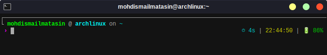

# Suprima-Asra Zsh Theme

A feature-rich, minimalistic zsh theme based on the [Ultima theme](https://github.com/egorlem/ultima.zsh-theme) by Egor Lem, enhanced with additional functionality for modern development workflows.

## ✨ Features

### 🎨 Visual Design



- **Clean minimalistic interface** with Unicode box-drawing characters
- **Full-width separator line** that spans the entire terminal width
- **Custom arrow symbols** (›) for consistent visual flow
- **Color-coded elements** for better readability and visual hierarchy

### 🔧 Version Control Support

- **Multi-VCS support**: Git, SVN, and Mercurial
- **Real-time git status** with comprehensive file state indicators:
  - `A` - Added/staged files (green)
  - `M` - Modified files (cyan)
  - `U` - Untracked files (blue)
- **Branch name display** with color coding
- **Git hash display** (6 characters) during actions
- **Action status** (rebase, merge, etc.)

### 🖥️ System Information

- **SSH connection indicator** - Shows "SSH:" when connected remotely
- **Battery status** (Linux) with color-coded icons:
  - 🔋 Green (>80%), Yellow (30-80%), Red (<30%)
  - ⚡ Charging indicator
- **Command execution timing** - Shows duration for commands taking >5 seconds
- **Exit status display** - Red ✗ with error code for failed commands
- **Current time** display
- **Username in directory info**

### 🚀 Development Environment Detection

- **Python virtual environment** - Shows active venv name
- **Node.js version** - Displays Node version when in JS/TS projects
- **Docker detection** - 🐳 icon when Dockerfile or docker-compose files present
- **Project context awareness** - Detects package.json, .nvmrc, node_modules

### 🎯 Enhanced Shell Experience

- **Intelligent tab completion** with caching and color coding
- **Custom LS_COLORS** for file type differentiation
- **Optimized LESS/MAN page viewing** with color support
- **Case-insensitive completion matching**
- **Menu-based completion selection**

## 🛠️ Installation

### Oh My Zsh

1. Download the theme to your Oh My Zsh themes directory:

```bash
curl -o ~/.oh-my-zsh/themes/suprima-asra.zsh-theme https://raw.githubusercontent.com/your-username/suprima-asra/main/suprima-asra.zsh-theme
```

2. Set the theme in your `~/.zshrc`:

```bash
ZSH_THEME="suprima-asra"
```

3. Reload your shell:

```bash
source ~/.zshrc
```

### Manual Installation

1. Download the theme file:

```bash
wget https://raw.githubusercontent.com/your-username/suprima-asra/main/suprima-asra.zsh-theme
```

2. Source it in your `~/.zshrc`:

```bash
source /path/to/suprima-asra.zsh-theme
```

3. Reload your shell:

```bash
source ~/.zshrc
```

## 📋 Requirements

- **Zsh** 5.0 or later
- **Git** (for version control features)
- **A terminal** that supports Unicode and 256 colors
- **Font** with Unicode support for proper character rendering

### Optional Dependencies

- **Node.js** - For Node version display
- **Python** - For virtual environment detection
- **Docker** - For Docker project detection
- **Battery support** - Linux systems with `/sys/class/power_supply/BAT0`

## 🎛️ Configuration

The theme includes several configurable elements:

### VCS Support

By default, the theme is configured for Git. To change or disable VCS:

```bash
export VCS="git"    # Options: "git", "svn", "hg", or "" to disable
```

### Customizing Colors

The theme uses zsh color codes. Key color variables:

- Branch names: Green (`%F{green}`)
- Modified files: Cyan (`%F{cyan}`)
- Untracked files: Blue (`%F{blue}`)
- Error status: Red (`%F{red}`)
- Time display: Yellow (`%F{yellow}`)

### Timing Threshold

To change the command execution time threshold:

```bash
# Edit the cmd_exec_time function in the theme file
if (( elapsed > 5 )); then  # Change 5 to your preferred seconds
```

## 📱 Prompt Layout

### Left Prompt (PS1)

```bash
┌────────────────────────────────────────────────────────────
└ SSH: ~/current/path (username) on › branch-name
 › 
```

### Right Prompt (RPROMPT)

```bash
⏱ 7s | 🐳 | ⬢ 18.0.0 | venv-name | ✗ 1 | 14:30:25 | 🔋 85%
```

### Secondary Prompts

- **PS2**: Continuation prompt for multi-line commands
- **PS3**: Selection prompt for `select` statements

## 🎨 Color Scheme

The theme uses a carefully selected color palette:

- **Directories**: Cyan
- **Git branches**: Green
- **Modified files**: Cyan
- **Untracked files**: Blue
- **Staged files**: Green
- **Error indicators**: Red
- **Time/Battery**: Yellow
- **Username**: Gray
- **SSH indicator**: Green

## 🔧 Advanced Features

### Completion System

- **Cached completions** for faster performance
- **Color-coded completion menus**
- **Case-insensitive matching**
- **SSH host completion** from known_hosts
- **File type awareness** with ignored patterns

### Terminal Enhancements

- **Enhanced LESS pager** with syntax highlighting
- **Improved MAN pages** with color support
- **Smart file listing** with LS_COLORS
- **History optimization**

## 🤝 Contributing

1. Fork the repository
2. Create a feature branch: `git checkout -b feature/amazing-feature`
3. Commit your changes: `git commit -m 'Add amazing feature'`
4. Push to the branch: `git push origin feature/amazing-feature`
5. Open a Pull Request

## 📜 License

This project is licensed under the same terms as the original Ultima theme.

## 🙏 Acknowledgments

- **Egor Lem** - Original [Ultima theme](https://github.com/egorlem/ultima.zsh-theme) creator
- **Zsh community** - For the excellent shell and plugin ecosystem

## 📞 Support

If you encounter any issues or have questions:

1. Check the [Issues](https://github.com/your-username/suprima-asra/issues) page
2. Create a new issue with detailed information
3. Include your system information and zsh version

---

Made with ❤️ for developers who appreciate both functionality and aesthetics
