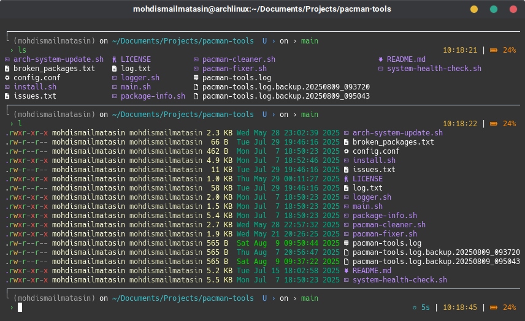

# Suprima ASRA Zsh Theme

An enhanced, performance-optimized Zsh theme for dark backgrounds, based on the [Ultima Zsh Theme](https://github.com/egorlem/ultima.zsh-theme) by Egor Lem. Suprima ASRA adds modern features, better error/status handling, and improved visuals for developers who want both aesthetics and functionality.

---

## Table of Contents

- [Overview](#overview)
- [Features](#features)
- [Installation](#installation)
- [Requirements](#requirements)
- [Configuration](#configuration)
- [Prompt Layout](#prompt-layout)
- [Technical Details](#technical-details)
- [Troubleshooting](#troubleshooting)
- [Contributing](#contributing)
- [License](#license)

---

## Overview

Suprima ASRA is a modern Zsh theme designed for developers who spend significant time in the terminal. It provides comprehensive system information, version control status, and project environment awareness—all while maintaining a clean, minimalist aesthetic optimized for dark terminal backgrounds.

### Screenshot



### Design Philosophy

- **Minimal & Clean**: Uses Unicode box-drawing characters for a refined look
- **Information Density**: Displays relevant context without clutter
- **Performance First**: Caching and lazy loading for large projects
- **Dark Background Optimized**: Color scheme tested on dark terminal themes

---

## Features

### Visual Design

- Minimal, clean interface with Unicode box-drawing and arrow characters
- Optimized for dark backgrounds and modern terminals
- Color-coded segments for status, VCS, and system info
- Full-width separator line for prompt clarity
- Intelligent truncation for long context names (Kubernetes, paths)

### Version Control & Project Awareness

- **Multi-VCS support:** Git, SVN, Mercurial (configurable)
- **Git enhancements:**
  - Real-time status: staged (A, green), modified (M, cyan), untracked (U, blue)
  - Branch name and short hash display
  - Action status (rebase, merge, etc.)
  - Ahead/behind remote tracking (↑↓ indicators)
  - Git stash count with magenta indicator
  - Untracked file detection
- **Project context detection:**
  - Python venv/conda environment name
  - Node.js version (auto-detected via package.json, .nvmrc, or node_modules)
  - Rust version (auto-detected via Cargo.toml)
  - Go version (auto-detected via go.mod)
  - Docker context (🐳 icon, running container count)
  - Kubernetes context (⎈ icon, with name truncation)

### System & Shell Information

- SSH connection indicator (green "SSH:")
- Battery status with cross-platform support:
  - Linux: `/sys/class/power_supply/BAT0`
  - macOS: `pmset` command
  - WSL: `powershell.exe` integration
  - Color-coded levels: Green (>80%), Yellow (50-80%), Orange (20-50%), Red (<20%)
  - Charging indicator (⚡)
- System load average (📊, shows only if >1.0)
- Memory usage percentage (🧠, shows only if >60%)
- Command execution timing with color-coded thresholds:
  - Cyan: 3-10 seconds
  - Yellow: 10-60 seconds
  - Red: >60 seconds (with minutes)
- Exit status with icon and code for failed commands:
  - ✗ 1: General error
  - ⚠ 2: Misuse of shell builtins
  - 🚫 126: Command cannot execute
  - ❓ 127: Command not found
  - 🛑 130: Interrupted (Ctrl+C)
- Current time (24-hour format, yellow)
- Username and working directory with hostname

### Enhanced Shell Experience

- Intelligent, color-coded tab completion with caching
- Custom `LS_COLORS` and `LSCOLORS` for file type highlighting
- Enhanced LESS/MAN page viewing with color support
- Case-insensitive, menu-based completion
- SSH host completion from `known_hosts`
- Performance optimizations for large projects
- History optimization

---

## Installation

### Oh My Zsh (Recommended)

1. Download the theme:

   ```zsh
   curl -o ~/.oh-my-zsh/themes/suprima-asra.zsh-theme \
     https://raw.githubusercontent.com/mohdismailmatasin/suprima-asra/main/suprima-asra.zsh-theme
   ```

2. Set in your `~/.zshrc`:

   ```zsh
   ZSH_THEME="suprima-asra"
   ```

3. Reload your shell:

   ```zsh
   source ~/.zshrc
   ```

### Manual Installation

1. Clone or download the repository
2. Copy `suprima-asra.zsh-theme` to your Zsh themes directory
3. Source the theme in your `.zshrc`:

   ```zsh
   source /path/to/suprima-asra.zsh-theme
   ```

---

## Requirements

### Required

- **Zsh** 5.0+ (tested on 5.8+)
- **Git** (for VCS features)
- **Terminal** with Unicode & 256 color support
- **Font** with Unicode glyphs (Nerd Fonts recommended)

### Optional (for extra features)

| Feature | Command/Tool | Detection Method |
|---------|--------------|------------------|
| Node.js version | `node` | `package.json`, `.nvmrc`, `node_modules/` |
| Python environment | `python` | `VIRTUAL_ENV`, `CONDA_DEFAULT_ENV` |
| Rust version | `rustc` | `Cargo.toml` |
| Go version | `go` | `go.mod` |
| Docker status | `docker` | `Dockerfile`, `docker-compose.yml` |
| Kubernetes | `kubectl` | Current kubectl context |
| Battery (Linux) | - | `/sys/class/power_supply/BAT0` |
| Battery (macOS) | `pmset` | System power management |
| Battery (WSL) | `powershell.exe` | Windows WMI |
| System load | `uptime` | Standard Unix command |
| Memory usage | `free` (Linux) / `vm_stat` (macOS) | System monitoring |

---

## Configuration

### VCS Support

By default, Git is enabled. To change or disable VCS, add to your `.zshrc` before loading the theme:

```zsh
export VCS="git"    # Options: "git", "svn", "hg", or "" to disable
```

### Timing Thresholds

The command execution time color thresholds are:
- **Cyan**: 3-10 seconds
- **Yellow**: 10-60 seconds
- **Red**: >60 seconds (displays as XmYs)

To customize, edit the `cmd_exec_time` function in the theme file.

### Color Customization

All colors use Zsh's `%F{color}` format. Common colors:
- `green` - Success, staged files, SSH indicator
- `cyan` - Directories, modified files, moderate timing
- `blue` - Untracked files, Kubernetes
- `yellow` - Time, Python env, medium battery
- `red` - Errors, high load, critical battery
- `magenta` - Git stash count, prompt arrow
- `white` - Text, separators
- `248` (grey) - Box drawing elements

---

## Prompt Layout

### Left Prompt (PS1)

```
┌────────────────────────────────────────────────────────────────────────
└ SSH: (username) @ (hostname) on ~/current/path › branch-name [↑↓]
  ›
```

Components:
1. **Full-width top border** (dim grey box-drawing character)
2. **Connection indicator** - "SSH:" if connected via SSH
3. **User info** - Username in green, hostname in cyan bold
4. **Current directory** - Full path in cyan
5. **Git status** - Branch name, hash, modification indicators, stash count
6. **Prompt arrow** - Magenta › character

### Right Prompt (RPROMPT)

Right-to-left display (appears only when relevant):

```
⏱ 7s | 📊 1.2 | 🧠 65% | ⎈ context | 🐳[2] | 🦀 1.70 | 🐹 1.21 | ⬢ 18.0.0 | 🐍 venv | ✗ 1 | 14:30:25 | 🔋 85%
```

Order of segments (right to left):
1. **Battery** 🔋 - With percentage and charging indicator
2. **Time** - 24-hour format
3. **Exit status** - If last command failed
4. **Python env** 🐍 - Virtualenv or conda name
5. **Node.js** ⬢ - Version if in Node project
6. **Go** 🐹 - Version if in Go project
7. **Rust** 🦀 - Version if in Rust project
8. **Docker** 🐳 - Icon and running container count
9. **Kubernetes** ⎈ - Context name (truncated if >15 chars)
10. **Memory** 🧠 - Usage percentage (if >60%)
11. **Load** 📊 - System load average (if >1.0)
12. **Execution time** ⏱ - Color-coded by duration

### Secondary Prompts

- **PS2** (continuation): ` command › ` (white text, cyan arrow)
- **PS3** (select): ` › ` (simple arrow)

---

## Technical Details

### Architecture

The theme is organized into logical segments:

1. **Variable Definitions** - ANSI codes, Unicode characters
2. **VCS Configuration** - Git/SVN/Mercurial setup with hooks
3. **Status Functions** - Battery, load, memory, command timing
4. **Environment Detection** - Language-specific project detection
5. **Prompt Construction** - PS1, RPROMPT, PS2, PS3 definitions
6. **Completion System** - Enhanced Zsh completion with caching
7. **Color Exports** - LS_COLORS, LESS, MAN page colors

### Performance Optimizations

- **Completion caching**: Uses `~/.zsh/cache` for faster completions
- **Lazy loading**: Project environments only checked when relevant files exist
- **Conditional display**: System info only shows when above thresholds
- **Efficient VCS**: Uses `vcs_info` with minimal git calls
- **Hook-based updates**: Git status updated via Zsh hooks

### Key Zsh Features Used

- `vcs_info` - Version control information system
- `precmd` / `preexec` hooks - Pre/post command execution
- `compinit` - Completion system initialization
- `PROMPT_SUBST` - Dynamic prompt evaluation
- `zstyle` - Configuration system for completions

---

## Troubleshooting

### Theme doesn't load

1. Ensure Zsh is your default shell: `chsh -s $(which zsh)`
2. Check Zsh version: `zsh --version` (need 5.0+)
3. Verify theme path is correct in `.zshrc`

### Unicode characters not displaying

1. Use a font with Unicode support (Nerd Fonts recommended)
2. Check terminal encoding: `echo $LANG` (should include UTF-8)
3. Try different terminal emulator

### Git status not showing

1. Ensure Git is installed: `git --version`
2. Check if in a Git repository: `git rev-parse --git-dir`
3. Verify `VCS` variable is set: `echo $VCS`

### Battery status not showing

- **Linux**: Check `/sys/class/power_supply/BAT0/capacity` exists
- **macOS**: Run `pmset -g batt` to test
- **WSL**: Ensure `powershell.exe` is accessible

### Slow prompt in large repositories

The theme includes optimizations, but for very large repos:
1. Disable untracked file detection (edit `+vi-use_git_untracked`)
2. Reduce `vcs_info` checks
3. Consider using `git config --add oh-my-zsh.hide-status 1`

---

## Contributing

Contributions are welcome! Please follow these steps:

1. Fork the repository
2. Create a feature branch: `git checkout -b feature/amazing-feature`
3. Make your changes
4. Test on multiple platforms if possible
5. Commit your changes: `git commit -m 'Add amazing feature'`
6. Push to the branch: `git push origin feature/amazing-feature`
7. Open a Pull Request

### Code Style

- Use descriptive variable names
- Add comments for complex logic
- Follow existing indentation (2 spaces)
- Test on both light and dark backgrounds

---

## License

This project is licensed under the **MIT License** - see the [LICENSE](LICENSE) file for details.

The theme is based on the [Ultima Zsh Theme](https://github.com/egorlem/ultima.zsh-theme) by Egor Lem.

---

## Acknowledgments

- **Egor Lem** - Original [Ultima theme](https://github.com/egorlem/ultima.zsh-theme) creator
- **Zsh community** - For the excellent shell and plugin ecosystem
- **Oh My Zsh** - For the framework that makes Zsh themes accessible

---

## Support

If you encounter issues:

1. Check the [Issues](https://github.com/mohdismailmatasin/suprima-asra/issues) page
2. Create a new issue with:
   - System info (OS, Zsh version, terminal)
   - Steps to reproduce
   - Screenshot if applicable

---

Thanks For Your Support! Long Live ZSH!
